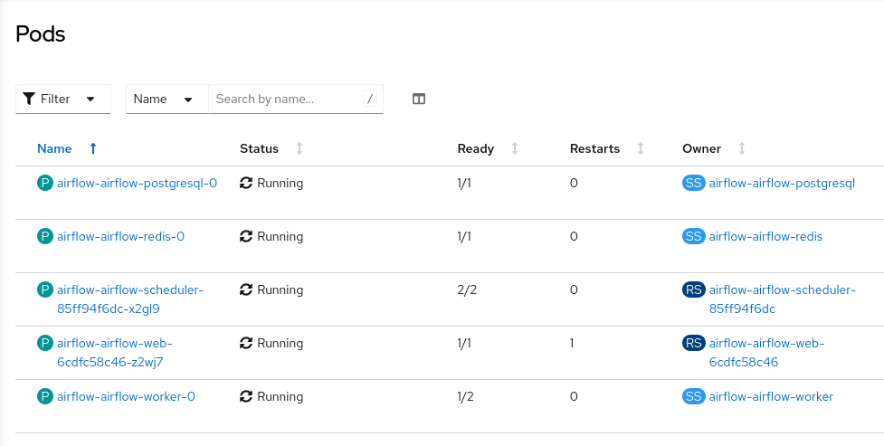

# Airflow on OpenShift

A source compiled Airflow based on RedHat's ubi container images.

## (Optional) Build Images Locally

The chart is configured to use the pre-built public images in quay.io

To build the images locally use the make target

```bash
make build
```

To push to quay.io (see Makefile for repo adjustment)

```bash
make push
```

## Create a DAG Repo

To deploy with the default configuration, you will need a git repository to store DAG's in. By default the Airflow pods use a ubi based fork of Kubernetes golang based [git-sync](https://github.com/eformat/git-sync) container.

For example, create a private DAG repo in Github. Create a new project and the following secret in the OpenShift cluster you are about to deploy to prior to installing the Airflow helm chart.

```bash
oc new-project airflow
```

```bash
export GIT_SERVER=github.com
export GITHUB_USER=<your git username>
export GITHUB_TOKEN=<your git token>

cat <<EOF | oc -n airflow apply -f-
apiVersion: v1
data:
  password: "$(echo -n ${GITHUB_TOKEN} | base64)"
  username: "$(echo -n ${GITHUB_USER} | base64)"
kind: Secret
metadata:
  name: git-auth
type: kubernetes.io/basic-auth
EOF
```

### Deploying to OpenShift using helm

Deploy Airflow and set your DAG repo and sync time (seconds):

```bash
helm upgrade --install chart/airflow \
  --set gitSync.repo="https://github.com/${GITHUB_USER}/your-dags-repo.git" \
  --set gitSync.branch="main" \
  --set gitSync.wait="10"
```

All going well you should see the following pods running.



Browse to Airflow using the created route. The default Airflow Role is set to `AUTH_ROLE_PUBLIC = "Admin"`. Airflow should sync any DAG's you have in your dag git repo (it will be empty if you have none).


## Other Configurations

Helm deploys the applications and configures the k8s secrets. Check the chart [chart/airflow/values.yaml](chart/airflow/values.yaml) file for all the options.

We set some random default values that you should override for anything other than testing - see [chart/airflow/templates/secrets.yaml](chart/airflow/templates/secrets.yaml)

The default random values are:

```bash
    WEBSERVER_SECRET_KEY="ff5669cc17a95211"
    OAUTH_API_BASE_URL="https://keycloak/auth/realms/my-realm/protocol/openid-connect"
    OAUTH_TOKEN_URL="https://keycloak/auth/realms/my-realm/protocol/openid-connect/token"
    OAUTH_AUTHORIZE_URL="https://keycloak/auth/realms/my-realm/protocol/openid-connect/auth"
    OAUTH_LOGOUT_REDIRECT_URL="https://keycloak/auth/realms/my-realm/protocol/openid-connect/logout?client_id=aflow"
    OAUTH_CLIENT_ID="aflow"
    OAUTH_CLIENT_SECRET="79a1a5871fb52d3c0c922b878ff05e0b"
    POSTGRESQL_ADMIN_PASSWORD="6d6ecdf7805ee81b"
    POSTGRESQL_USER="bn_airflow"
    POSTGRESQL_PASSWORD="6a9e5cf7"
    POSTGRESQL_DATABASE="bitnami_airflow"
    REDIS_PASSWORD="ad2a251b"
    AIRFLOW_PASSWORD="f816c493"
    AIRFLOW_FERNETKEY="LbqumqMCI20kRt2Bt2QsQA2urRs28XEM"
```

Authentication for Airflow Web is **DISBALED** by default in the chart.

The configuration supports OAUTH against common tools like Keycloak/RedHat SSO configured against OpenShift OAUTH as an example. You can re-enable this auth by uncommenting the following configuration code marked with the text **# DISABLE OAUTH**

- `webserver_config.py` Airflow Web configuration - [chart/airflow/templates/configmap.yaml](chart/airflow/templates/configmap.yaml)
- `service-accounts.yaml` Enable the **OAuthRedirectReference** for the service account if you have configured SSO onto OpenShift via Keycloak in - [chart/airflow/templates/service-accounts.yaml](chart/airflow/templates/service-accounts.yaml)

If you wish to create images suitable for disconnected installation, override:

- [base/pip.conf](base/pip.conf) to set a custom pypi repository
- [base/cacerts.pem](base/cacerts.pem) to set custom TLS CA certificates

The `airflow-runner` image is highly customizable. The example image is used for Airflow pipelines configured using [elyra](https://github.com/elyra-ai/elyra/blob/main/docs/source/recipes/configure-airflow-as-a-runtime.md).
